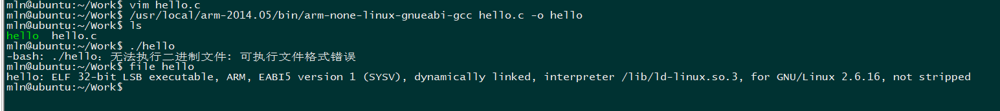

# 华迪实习

---
## ==6月24日==
### PC与嵌入式计算机
参考微处理器与嵌入式系统设计课程内容。介绍计算机的体系结构、组成等。
### 开发环境及配置
1. 介绍了在VMware中安装Ubuntu20.04LTS的方法
2. 介绍通过运维三大神器之一sed来实现CLI换源操作，对sudo apt update命令作用做了分析介绍
3. 安装openssh服务端，通过xshell、secureCRT、CMD、powershell等工具来实现对linux的访问，此处也介绍了systemctl命令的常用用法status、enabled、start等
4. 介绍cd ls mkdir rm 等文件操作命令及参数
5. 介绍文件权限管理命令chmod以及文件类型判断、文件权限修改等
6. 介绍环境变量的概念，以及影响环境变量的多个配置文件，有系统级和用户级配置文件
7. 介绍tar的归档打包与解包
### 总结
第一天实习主要工作是配置Linux（Ubuntu）环境，学习并实践Linux常用命令（主要针对的是文件管理的命令）。因为有Linux基础，学习起来相对轻松。

---


## ==6月25日==
### vi/vim的安装与使用

vim是Linux命令行最强大的编辑器之一，快捷键操作是它最大的特点。拥有Linux基础不再过多描述这一部分

### 交叉编译环境的搭建

交叉编译是指在x86的平台上从源代码开始编译适用于arm架构的程序，甚至是x86_64编译arm32的程序。

1. Ubuntu20.04最小安装缺少基本的C的编译环境，我们可以从apt包管理器下载安装基本的编译环境

```shell
#安装为64位的环境
sudo apt install build-essential
#若需要32位的函数库支持
sudo apt-get install  lib32stdc++6
#为gcc编译32位程序做准备
sudo dpkg --add-architecture i386
sudo apt update
sudo apt install gcc-multilib g++-multilib
```

2. 至此，我们搭建了Ubuntu上编译x86和x86_64位C程序的环境，接下来我们通过SecureFX、winSCP等软件上传开发板的arm下的C语言编译器，并进行如下操作

```shell
#此为归档文件，我们用tar命令解包,注意此为绿色软件（已经编译好的二进制文件），为了Linux的使用规范，我们将其解包到/usr/local下，而/usr/local是root用户的目录，普通用户需要sudo权限才能进行写的操作
sudo tar jxvf arm-2014.05-29-arm-none-linux-gnueabi-i686-pc-linuxgnu.tar.bz2 -C /usr/local
#检查是否安装完成
/usr/local/arm-2014.05/bin/arm-none-linux-gnueabi-gcc -V
```

3. 至此，我们完成了检查编译环境的搭建，我们使用此环境简单编译hello world程序

```shell
/usr/local/arm-2014.05/bin/arm-none-linux-gnueabi-gcc hello.c -o hello
```



4. 添加环境变量

   ```shell
   sudo vim /etc/profile
   添加以下内容
   export PATH=/usr/local/arm-2014.05/bin:$PATH
   ```

   ```shell
   #使上面修改生效
   source /etc/profile
   ```

   

***

## ==6月24日==

### 通过内核控制LDE亮灭

```c
#include <stdio.h>
#include <stdlib.h>
#include <sys/types.h>
#include <sys/stat.h>
#include <fcntl.h>
#include <sys/ioctl.h>
#include <unistd.h>


int main()
{
    int fd;
    int ret;

    fd = open("/dev/leds",O_RDWR);
    if (-1==fd)
    {
        printf("打开设备失败\n");
        exit(1);
    }
    while(1)
    {
        ioctl(fd,0,0);
        ioctl(fd,1,1);
        sleep(1);
        ioctl(fd,1,0);
        ioctl(fd,0,1);
        sleep(1);
    }
}
```


```c
#include <stdio.h>
#include <stdlib.h>
#include <sys/types.h>
#include <sys/stat.h>
#include <fcntl.h>
#include <sys/ioctl.h>
#include <unistd.h>


int main()
{
    int fd;
    int ret;

    fd = open("/dev/leds",O_RDWR);
    if (-1==fd)
    {
        printf("打开设备失败\n");
        exit(1);
    }
    while(1)
    {
        ioctl(fd,0,0);
        ioctl(fd,0,1);
        sleep(1);
        ioctl(fd,1,0);
        ioctl(fd,1,1);
        sleep(1);
    }
}
```

### Linux内核编译

Linux内核编译的重点是.config文件的修改，即自己需要选择适合自己机器（开发板）的套件，而我们为了简化难度，.config文件老师已经给出，我们执行下面的命令

```shell
#添加NFS文件系统
make menuconfig
#确定编译环境的内核数
方法一：
cat /proc/cpuinfo | grep process
方法二：
nproc
#编译
make -j4
```


### QT环境配置

```shell
sudo apt install cmake qt5-default qtcreator 
sudo apt install libclang-common-8-dev
```

通过sftp服务上传arm的QT包并执行

```shell
sudo tar -zxvf qt5.12.8.tar.gz -C /opt
```


### 交叉编译openSSH服务

1. 下载安装openSSH的包及依赖并解压缩

   ```shell
   tar -zxvf openssh-9.0p1.tar.gz 
   tar -zxvf openssl-3.0.3.tar.gz 
   tar -zxvf zlib-1.2.11.tar.gz 
   ```

2. 编译zlib（此处给自己埋坑，没有安装到/opt目录下）

   ```shell
   CC=arm-none-linux-gnueabi-gcc ./configure  --prefix=~/soft/zlib
   make -j4
   make install 
   ```

3. 编译openssl

   ```shell
   ./Configure  linux-armv4 no-asm  --prefix=~/soft/openssl  --cross-compile-prefix=arm-none-linux-gnueabi-  -march=armv7-a
   make -j4
   make install
   ```

4. 编译openssh

   ```shell
   ./configure --host=arm-linux --with-zlib=~/soft/zlib --with-ssl-dir=~/soft/openssl --prefix=~/openssh CC=arm-none-linux-gnueabi-gcc AR=arm-none-linux-gnueabi-ar
   make -j4
   make install
   ```

5. 打包

   ```shell
   #在~/openssh/bin目录下
   cp ssh scp sftp ssh-agent ssh-keygen ~/openssh/bin
   cp ssh-add ssh-keyscan ~/openssh/bin
   cp ssh-sk-helper ssh-pkcs11-helper sftp-server ~/openssh/libexec/
   cp sshd ~/openssh/sbin/
   cp moduli ssh_config sshd_config ~/openssh/etc/
   #在~/openssh/lib目录下
   cp /home/mln/soft/zlib/lib/libz.* -rav .
   cp /home/mln/soft/openssl/lib/libcrypto.* -rav .
   cp /usr/local/arm-2014.05/arm-none-linux-gnueabi/libc/usr/lib/libatomic.* -av .
   #在~目录下
   tar zcvf openssh-9.0p1-binary.tar.gz openssh
   ```

   


### 在开发板上部署openSSH服务

1. 将打包好的openSSH包通过tftp上传至开发板并解包

```shell
tar zxvf openssh-9.0p1-binary.tar.gz -C /home/mln
chown root:root /home/mln/openssh -R
```

**说明，由于前面给自己挖坑，此处需要单独创建/home/mln的目录**

2. 通过ssh-keygen 生成公私钥对

   ```shell
   cd /home/mln/openssh/etc
   /home/mln/openssh/bin/ssh-keygen -t rsa /home/mln/openssh/etc/ssh_host_rsa_key -N ""
   /home/mln/openssh/bin/ssh-keygen -t rsa /home/mln/openssh/etc/ssh_host_rsa_key_key -N ""
   /home/mln/openssh/bin/ssh-keygen -t dsa /home/mln/openssh/etc/ssh_host_dsa_key -N ""
   ```

3. 添加sshd用户

   ```shell
    echo "sshd:x:74:74:sshd user:/var/empty/sshd:/user/sbin/nologin" >> /etc/passwd
    echo "sshd:x:74:"  >> /etc/group
   ```

   

4. 修改sshd_config

   ```shell
   vi /home/mln/openssh/etc/sshd_config
   PermitRootLogin yes
   Subsystem       sftp    /home/mln/openssh/libexec/sftp-server 
   ```

5. 将lib库添加到本地

   ```shell
   cp /home/mln/openssh/lib/* /lib
   chown root:root /lib
   ```

   

5. 添加开启启动项

   ```shell
   vi /etc/init.d/rcS
   /home/mln/openssh/sbin/sshd -h /home/mln/openssh/etc/ssh_host_rsa_key
   ```

   


### 编译lrzsz

1. 下载源码并解包

   ```shell
   wget https://ohse.de/uwe/releases/lrzsz-0.12.20.tar.gz
   tar zxvf lrzsz-0.12.20.tar.gz
   ```

   

2. 编译安装

   ```shell
   CC=arm-none-linux-gnueabi-gcc ./configure --cache-file=./arm-linux.cache --prefix=~/lrzsz --host=arm-linux --build=arm-linux
   make 
   make install
   ```

   

### SSH隧道连接开发板

实习过程中最恼火的可能就是小组同学因为没有在同一局域网下不能同时下板进行操作，在检查编译openSSH后，如果手头有公网服务器，我们可以通过SSH隧道实现开发板的远程连接。

SSH分为本地隧道和远程隧道两类：

**本地隧道**是在本机映射其他机器的端口，即我们可以实现访问本机的某个端口，从而实现对其他机器的访问，一般在公网端建立本地隧道：

```shell
ssh -fCNL 本地IP:本机端口:远端IP:远端端口 远端用户名@远端IP
```

**远程隧道**是通过命令行将本机的某个端口映射到远端的机器上，一般实在非公网端建立远程隧道：

```shell
ssh -fCNR 本地IP:本机端口:远端IP:远端端口 远端用户名@远端IP
```

如果网络基础比较扎实，我们不难分析出，远程隧道更适合我们的应用场景，即我们在开发板上执行远程隧道指令。为了应对开发板频繁的重启，我们不妨将这条指令写入**/etc/init.d/rcS**中，做到开机自启动，同时我们需要配置公钥登录来保证SSH的开机正常连接，同时注意公网服务器的==防火墙==设置。另外一点，这种建立的连接在公网端一般为127.0.0.1即本地回环地址，我们需要修改公网服务器**/etc/ssh/sshd_config**

```shell
GatewayPorts yes
```

此时，我们开发板是面向公网的，需要设置复杂的密码，或者禁用密码登录。

##  ==6月27日==

```c++
//widget.h
#ifndef WIDGET_H
#define WIDGET_H

#include <QWidget>

QT_BEGIN_NAMESPACE
namespace Ui { class Widget; }
QT_END_NAMESPACE

class Widget : public QWidget
{
    Q_OBJECT

public:
    Widget(QWidget *parent = nullptr);
    ~Widget();
    int fd;


private slots:

    void on_rbLed1On_clicked();

    void on_rbLed1Down_clicked();

    void on_rbLed2On_clicked();

    void on_rbLed2Down_clicked();

    void on_pbExit_clicked();

private:
    Ui::Widget *ui;
};

#endif // WIDGET_H

```


```c++
//main.cpp
#include "widget.h"

#include <QApplication>

int main(int argc, char *argv[])
{
    QApplication a(argc, argv);
    Widget w;
    w.show();
    return a.exec();
}

```

```c++
#include "widget.h"
#include "ui_widget.h"
#include <stdio.h>
#include <stdlib.h>
#include <sys/types.h>
#include <sys/stat.h>
#include <fcntl.h>
#include <sys/ioctl.h>
#include <unistd.h>
#include <QPixmap>

Widget::Widget(QWidget *parent)
    : QWidget(parent)
    , ui(new Ui::Widget)
{
    ui->setupUi(this);
    fd = open("/dev/leds",O_RDWR);
    ioctl(fd,0,0);
    ioctl(fd,0,1);

}

Widget::~Widget()
{
    delete ui;
}

void Widget::on_rbLed1On_clicked()
{
    ioctl(fd,1.0);
    ui->label->setScaledContents(true);
    ui->label->setPixmap(QPixmap(":/jpg/OIP-C1.jpg"));
}

void Widget::on_rbLed1Down_clicked()
{
    ioctl(fd,0,0);
    ui->label->setScaledContents(true);
    ui->label->setPixmap(QPixmap(":/jpg/OIP-C.jpg"));
}

void Widget::on_rbLed2On_clicked()
{
    ioctl(fd,1,1);
    ui->label_2->setScaledContents(true);
    ui->label_2->setPixmap(QPixmap(":/jpg/OIP-C1.jpg"));
}

void Widget::on_rbLed2Down_clicked()
{
    ioctl(fd,0,1);
    ui->label_2->setScaledContents(true);
    ui->label_2->setPixmap(QPixmap(":/jpg/OIP-C.jpg"));
}

void Widget::on_pbExit_clicked()
{
    ioctl(fd,0,0);
    ioctl(fd,0,1);
    close();
}


```

## ==6月29日==

### GIF动图控制

**widget.cpp**

```c++
#include "widget.h"
#include "ui_widget.h"
#include "QMovie"
#include "QPixmap"
#include "QImage"
#include "QPicture"
#include "QPaintEvent"


Widget::Widget(QWidget *parent)
    : QWidget(parent)
    , ui(new Ui::Widget)
{
    flag=true;
    ui->setupUi(this);
    QMovie *mv = new QMovie(":/gif/test.gif");
    ui->label->setMovie(mv);
    ui->pushButton->setText("继续/暂停");
    ui->pushButton_2->setText("开始");
    ui->pushButton_3->setText("停止");
    ui->pushButton_4->setText("退出");
    mv->start();
    mv->setPaused(flag);
    ui->pushButton->setEnabled(false);
    ui->pushButton_3->setEnabled(false);

    connect(ui->pushButton,&QPushButton::clicked,this,[=]{

        mv->setPaused(flag);
        flag = !flag;
        this->update();
        ui->pushButton->setEnabled(true);
        ui->pushButton_3->setEnabled(true);
        ui->pushButton_2->setEnabled(false);
    });
    connect(ui->pushButton_2,&QPushButton::clicked,this,[=]{
        this->update();
        mv->start();
        ui->pushButton->setEnabled(true);
        ui->pushButton_3->setEnabled(true);
        ui->pushButton_2->setEnabled(false);

    });
    connect(ui->pushButton_3,&QPushButton::clicked,this,[=]{
        this->update();
        mv->stop();
        ui->pushButton->setEnabled(false);
        ui->pushButton_3->setEnabled(false);
        ui->pushButton_2->setEnabled(true);
    });
    connect(ui->pushButton_4,&QPushButton::clicked,this,[=]{
        this->close();
    });
}

Widget::~Widget()
{
    delete ui;
}
```

**widget.h**

```c++
#ifndef WIDGET_H
#define WIDGET_H

#include <QWidget>

QT_BEGIN_NAMESPACE
namespace Ui { class Widget; }
QT_END_NAMESPACE

class Widget : public QWidget
{
    Q_OBJECT
    bool flag;
public:
    Widget(QWidget *parent = nullptr);
    ~Widget();

    void painEvent(QPaintEvent *);

private:
    Ui::Widget *ui;
};
#endif // WIDGET_H
```

**main.cpp**

```c++
#include "widget.h"

#include <QApplication>

int main(int argc, char *argv[])
{
    QApplication a(argc, argv);
    Widget w;
    w.show();
    return a.exec();
}
```


### COS函数绘制

关键代码

```c++
void Widget::paintEvent(QPaintEvent *)
{
    //绘制COS函数图像
    QPainter my_paint(this);
    my_paint.translate(-400,50);
    my_paint.setPen(QColor(0,0,255));
    double num_x[1000] = {0.0};
    int num_y[1000] = {0};
    double encrease = 0.1;
    for(int i = 0;i < 1000;i++)
    {
        num_x[i] += encrease;
        encrease += 0.1;
    }
    for (int i = 0;i < 1000; i++)
    {
        num_y[i] = 15*cos(num_x[i]);
    }
    for (int i = 0;i < 1000; i++)
    {
        my_paint.drawPoint(i,400+num_y[i]);
    }
}
```


## ==6月30日==

### 多线程与计时器实现

**widget.h**

```c++
#ifndef WIDGET_H
#define WIDGET_H

#include <QWidget>
#include <QTimerEvent>
#include "dothread.h"
QT_BEGIN_NAMESPACE
namespace Ui { class Widget; }
QT_END_NAMESPACE

class Widget : public QWidget
{
    Q_OBJECT

public:
    Widget(QWidget *parent = nullptr);
    ~Widget();
    void timerEvent(QTimerEvent *);

private slots:
    void on_pbStart_clicked();

    void on_pbPause_clicked();

    void on_pbStop_clicked();

private:
    Ui::Widget *ui;
    QTimer *time;
    DoThread *dosth;
    int count;
    int timer_id;
    int flag;
};
#endif // WIDGET_H
```

**dothread.h**

```c++
#ifndef DOTHREAD_H
#define DOTHREAD_H

#include <QWidget>
#include <QThread>
#include <QTimer>
class DoThread : public QThread
{
    Q_OBJECT
public:
    explicit DoThread(QWidget *parent = nullptr);
    int i ;
    QTimer *timer;

signals:
    void sendSign(int);
    void finishedSign();
protected:
    void run();


};

#endif // DOTHREAD_H

```

**widget.cpp**

```c++
//计时器，多线程测试程序
#include "widget.h"
#include "ui_widget.h"
Widget::Widget(QWidget *parent)
    : QWidget(parent)
    , ui(new Ui::Widget)
{
    ui->setupUi(this);
    count = 0;
    flag = -1;
    dosth = new DoThread(this);
    ui->pbStart->setEnabled(true);
    ui->pbPause->setEnabled(false);
    ui->pbStop->setEnabled(false);

}

Widget::~Widget()
{
    delete ui;
}


void Widget::on_pbStart_clicked()
{

    timer_id = this->startTimer(1000);
    ui->pbStart->setEnabled(false);
    ui->pbPause->setEnabled(true);
    ui->pbStop->setEnabled(true);
    dosth->start();
    connect(dosth,&DoThread::sendSign,this,[=](int i){
        ui->lcdNumber_2->display(i);
    });
}

void Widget::on_pbPause_clicked()
{
    this->killTimer(timer_id);
    ui->pbStart->setEnabled(true);
    ui->pbPause->setEnabled(false);
    ui->pbStop->setEnabled(false);
}

void Widget::on_pbStop_clicked()
{
    this->killTimer(timer_id);
    count = 0;
    ui->lcdNumber->display(0);
    ui->pbStart->setEnabled(true);
    ui->pbPause->setEnabled(false);
    ui->pbStop->setEnabled(false);
}

void Widget::timerEvent(QTimerEvent *ev)
{
    ui->lcdNumber->display(++count);
}
```

**dothread.cpp**

```c++
#include "dothread.h"

DoThread::DoThread(QWidget *parent) : QThread(parent)
{
    i = 0;
    timer = new QTimer(this);
}

void DoThread::run()
{
    while(i < 100)
    {
        emit sendSign(i++);
        msleep(200);
    }
    emit finishedSign();

}

```


### 画图

**widget.h**

```c++
#ifndef WIDGET_H
#define WIDGET_H

#include <QWidget>
#include <QPainter>
#include <QMouseEvent>
#include <QPen>
#include <QPixmap>
QT_BEGIN_NAMESPACE
namespace Ui { class Widget; }
QT_END_NAMESPACE

class Widget : public QWidget
{
    Q_OBJECT

public:
    Widget(QWidget *parent = nullptr);
    ~Widget();
    void mouseMoveEvent(QMouseEvent *);
private:
    Ui::Widget *ui;
    QPainter *painter;
    QPen *pen;
    QPixmap *pixmap;
};
#endif // WIDGET_H
```

**wigdet.cpp**

```c++
#include "widget.h"
#include "ui_widget.h"
#include <QPainter>
#include <QPixmap>
#include <QMouseEvent>
#include <QPen>
#include <QDebug>

Widget::Widget(QWidget *parent)
    : QWidget(parent)
    , ui(new Ui::Widget)
{
    ui->setupUi(this);
    pen = new QPen;
    pixmap = new QPixmap(ui->label->size());
    painter = new QPainter(pixmap);
    pixmap->fill(Qt::white);
    pen->setWidth(6);
    pen->setColor(Qt::green);
    painter->setPen(*pen);
}

Widget::~Widget()
{
    delete ui;
}
void Widget::mouseMoveEvent(QMouseEvent *event)
{
    painter->drawPoint(event->pos());
    ui->label->setPixmap(*pixmap);
}
```


## ==7月1日==

### Windows和Linux互传文件乱码问题

在Linux命令行下

```shell
#实现文件内容转码
iconv  -f gbk -t utf-8 源文件名 -o 新文件名
#实现文件名转码
convmv -f gbk -t utf-8 源文件名 -o 新文件名
```

### Qt下的UDP通信

**widget.h**

```c++
#ifndef WIDGET_H
#define WIDGET_H

#include <QWidget>
#include <QUdpSocket>

QT_BEGIN_NAMESPACE
namespace Ui { class Widget; }
QT_END_NAMESPACE

class Widget : public QWidget
{
    Q_OBJECT

public:
    Widget(QWidget *parent = nullptr);
    ~Widget();

private slots:
    void on_pbExit_clicked();

private:
    Ui::Widget *ui;
    QUdpSocket *udpSocketSrv;
    QHostAddress ip;
    quint16 port;
    QPen *pen;
    QPainter *painter;
    QPixmap *pixmap;
    QImage image;
};
#endif // WIDGET_H

```

**widget.cpp**

```c++
#include "widget.h"
#include "ui_widget.h"
#include <QString>
#include <QDebug>
Widget::Widget(QWidget *parent)
    : QWidget(parent)
    , ui(new Ui::Widget)
{
    ui->setupUi(this);


    udpSocketSrv = new QUdpSocket(this);
    udpSocketSrv->bind(QHostAddress::Any,8888);
    connect(udpSocketSrv,&QUdpSocket::readyRead,this,[=]
    {
        ip = QHostAddress("0.0.0.1");
        port = 0;
        char rcvbuf[2048];
        qint64  rcv_len;
        rcv_len = udpSocketSrv->readDatagram(rcvbuf,sizeof(rcvbuf),&ip,&port);
        qDebug() << port ;
        rcvbuf[rcv_len] = '\0';
        if(rcv_len > 0)
        {
           ui->etReceive->append(QString("%1:%2->%3").arg(ip.toString()).arg(port).arg(rcvbuf));
        }
    });
    connect(ui->pbSend,&QPushButton::clicked,this,[=]
    {
       QString sendMsg =  ui->teSend->toPlainText();

       qint64 sendMsg_len = sendMsg.size();
       if(sendMsg_len > 0 && port > 0 )
       {
           sendMsg.append("\r\n");
           sendMsg_len = sendMsg.size();
           udpSocketSrv->writeDatagram(sendMsg.toUtf8().data(),sendMsg_len,ip,port);
           ui->etReceive->append(QString("myself:%1").arg(sendMsg));
       }

       ui->teSend->clear();
    });
}

Widget::~Widget()
{
    delete ui;
}


void Widget::on_pbExit_clicked()
{
    this->close();
}
```


### Qt下TCP通信

**widget.h**

```c++
#ifndef WIDGET_H
#define WIDGET_H

#include <QWidget>
#include <QTcpServer>
#include <QTcpSocket>
QT_BEGIN_NAMESPACE
namespace Ui { class Widget; }
QT_END_NAMESPACE

class Widget : public QWidget
{
    Q_OBJECT

public:
    Widget(QWidget *parent = nullptr);
    ~Widget();

private slots:
    void on_pbEixt_clicked();

private:
    Ui::Widget *ui;
    QTcpServer *tcpserver;
    QTcpSocket *tcpsocket;
};
#endif // WIDGET_H

```

**widget.cpp**

```c++
#include "widget.h"
#include "ui_widget.h"

Widget::Widget(QWidget *parent)
    : QWidget(parent)
    , ui(new Ui::Widget)
{
    ui->setupUi(this);
    tcpserver = new QTcpServer(this);
    tcpserver->listen(QHostAddress::Any,8888);
    connect(tcpserver,&QTcpServer::newConnection,this,[&]{
       tcpsocket = tcpserver->nextPendingConnection();
       connect(tcpsocket,&QTcpSocket::readyRead,this,[=]{
          QString rcvbuf =  QString("%1:%2->").arg(tcpsocket->peerAddress().toString()).arg(tcpsocket->peerPort());
          rcvbuf.append(tcpsocket->readAll());
           ui->teReceive->append(rcvbuf);
       });
    });
    connect(ui->pbSend,&QPushButton::clicked,this,[=]
    {
        QString sendMsg = ui->teSend->toPlainText();
        sendMsg.append("\r\n");
        tcpsocket->write(sendMsg.toUtf8());
        ui->teSend->clear();
        ui->teReceive->append(QString("myself:%1").arg(sendMsg));
    });

}

Widget::~Widget()
{
    delete ui;
}


void Widget::on_pbEixt_clicked()
{
    this->close();
}
```

### Qt下摄像头

**widget.h**

```c++
#ifndef WIDGET_H
#define WIDGET_H

#include <QWidget>
#include <QPixmap>
#include <videodevice.h>
#include <QImage>
#include <QTimer>
#include <QPaintEvent>
#include <QDateTime>

QT_BEGIN_NAMESPACE
namespace Ui { class Widget; }
QT_END_NAMESPACE

class Widget : public QWidget
{
    Q_OBJECT

public:
    Widget(QWidget *parent = nullptr);
    ~Widget();
    void yuyv422_to_rgb888(unsigned char *yuyvdata, unsigned char *rgbdata, int w, int h);
    void  paintEvent(QPaintEvent *);
private:
    Ui::Widget *ui;
   int lcd_win_width;
   int  lcd_win_height;
   int  lcd_rgb_bpp;

   int  frame_width;
   int frame_height;

   QPixmap *pix;

   VideoDevice  *cam_vd;

   uchar *camera_buff_raw;
   uchar *camera_buff_rgb;

   size_t  frame_len;
   QImage  *image;
   QTimer  *timer;

   int  fps;

   QDateTime  curdatetime;
   QDateTime  predatetime;


};
#endif // WIDGET_H
```

**videodevice.h**

```c++
#ifndef VIDEODEVICE_H
#define VIDEODEVICE_H

#include <string.h>
#include <stdlib.h>
#include <errno.h>
#include <fcntl.h>


#include <sys/ioctl.h>
#include <sys/mman.h>

#include <asm/types.h>
#include <linux/videodev2.h>

#include <QString>
#include <QObject>

#define CLEAR(x) memset(&(x), 0, sizeof(x))

class VideoDevice : public QObject
{
    Q_OBJECT
public:
    VideoDevice(QString dev_name);
    //VideoDevice();
    int open_device();
    int close_device();
    int init_device();
    int start_capturing();
    int stop_capturing();
    int uninit_device();
    int get_frame(void **, size_t*);
    int unget_frame();

private:
    int init_mmap();

    struct buffer
    {
        void * start;
        size_t length;
    };
    QString dev_name;
    int fd;
    buffer* buffers;
    unsigned int n_buffers;
    int index;

signals:
    void display_error(QString);

};

#endif // VIDEODEVICE_H
```

**widget.cpp**

```c++
#include "widget.h"
#include "ui_widget.h"
#include <QMessageBox>
#include <QDebug>
#include <QDateTime>
#include <QPen>
#include <QPainter>

Widget::Widget(QWidget *parent)
    : QWidget(parent)
    , ui(new Ui::Widget)
{
    ui->setupUi(this);

    lcd_win_width  = 320;
    lcd_win_height  =240;
    lcd_rgb_bpp = 24;

    frame_width = 320;
    frame_height = 240;

    curdatetime  = QDateTime::currentDateTime();
    predatetime  = curdatetime;

    timer = new QTimer(this);

    camera_buff_raw = (uchar *) malloc(frame_width*frame_height* lcd_rgb_bpp/8);
    frame_len = 0;

    camera_buff_rgb  = (uchar *) malloc(frame_width*frame_height* lcd_rgb_bpp/8);

    image = new  QImage(camera_buff_rgb,frame_width,frame_height,QImage::Format_RGB888);

    //ui->label->setGeometry(0,0,lcd_win_width,lcd_win_height);


    pix = new QPixmap(ui->label->size());

    pix->fill(Qt::black);
    ui->label->setPixmap(*pix);

    cam_vd  = new  VideoDevice("/dev/video0");

    connect(cam_vd,&VideoDevice::display_error,this,[=](QString msg)
    {
       QMessageBox::critical(this,"ERROR",QString("Camera Error:%1").arg(msg));
       exit(1);
    });


    cam_vd->open_device();
    cam_vd->init_device();
    cam_vd->start_capturing();

    connect(timer,&QTimer::timeout,this,[&]{
       curdatetime  = QDateTime::currentDateTime();
       cam_vd->get_frame((void **) &camera_buff_raw,(size_t *)&frame_len);
       yuyv422_to_rgb888(camera_buff_raw, camera_buff_rgb,frame_width,frame_height);
       *image = QImage(camera_buff_rgb,frame_width,frame_height,QImage::Format_RGB888);
       cam_vd->unget_frame();
       this->update();
   });

   timer->start(40);
}

Widget::~Widget()
{
    delete ui;
}


void Widget::paintEvent(QPaintEvent * ev)
{
    *pix  =  QPixmap::fromImage(*image,Qt::AutoColor);

    QPen  pen;
    QPainter painter(pix);
    pen.setColor(Qt::red);
    pen.setWidth(2);
    painter.setPen(pen);
    if(curdatetime > predatetime)
    {
        fps = 1000/predatetime.msecsTo(curdatetime);
        predatetime  = curdatetime;
    }
      painter.drawText(180,20,QDateTime::currentDateTime().toString("yyyy-MM-dd HH:mm:ss"));
      painter.drawText(20,20,QString("fps is:%1").arg(fps));

    //ui->label->setScaledContents(true);
    ui->label->setPixmap(*pix);


}


void Widget::yuyv422_to_rgb888(unsigned char *yuyvdata, unsigned char *rgbdata, int w, int h)
{
    //码流Y0 U0 Y1 V1 Y2 U2 Y3 V3 --》YUYV像素[Y0 U0 V1] [Y1 U0 V1] [Y2 U2 V3] [Y3 U2 V3]--》RGB像素
    int r1, g1, b1;
    int r2, g2, b2;
    int i;

    for(i=0; i<w*h/2; i++)
    {
        char data[4];
        memcpy(data, yuyvdata+i*4, 4);
        unsigned char Y0=data[0];
        unsigned char U0=data[1];
        unsigned char Y1=data[2];
        unsigned char V1=data[3];

        r1 = Y0+1.4075*(V1-128);
        if(r1>255) r1=255;
        if(r1<0)   r1=0;

        g1 =Y0- 0.3455 * (U0-128) - 0.7169*(V1-128);
        if(g1>255)  g1=255;
        if(g1<0)    g1=0;

        b1 = Y0 + 1.779 * (U0-128);
        if(b1>255)  b1=255;
        if(b1<0)    b1=0;

        r2 = Y1+1.4075*(V1-128);
        if(r2>255)  r2=255;
        if(r2<0)    r2=0;

        g2 = Y1- 0.3455 * (U0-128) - 0.7169*(V1-128);
        if(g2>255)    g2=255;
        if(g2<0)      g2=0;

        b2 = Y1 + 1.779 * (U0-128);
        if(b2>255)    b2=255;
        if(b2<0)      b2=0;

        rgbdata[i*6+0]=r1;
        rgbdata[i*6+1]=g1;
        rgbdata[i*6+2]=b1;
        rgbdata[i*6+3]=r2;
        rgbdata[i*6+4]=g2;
        rgbdata[i*6+5]=b2;
    }
}

```

**videodevice.cpp**

```c++
#include "videodevice.h"
#include <unistd.h>

VideoDevice::VideoDevice(QString dev_name)
{
    this->dev_name = dev_name;
    this->fd = -1;
    this->buffers = NULL;
    this->n_buffers = 0;
    this->index = -1;

}

int VideoDevice::open_device()
{
    fd = open(dev_name.toStdString().c_str(), O_RDWR/*|O_NONBLOCK*/, 0);
   // fd = open(dev_name.toStdString().c_str(), O_RDWR|O_NONBLOCK, 0);

    if(-1 == fd)
    {
        emit display_error(tr("open: %1").arg(QString(strerror(errno))));
        return -1;
    }
    return 0;
}

int VideoDevice::close_device()
{
    if(-1 == close(fd))
    {
        emit display_error(tr("close: %1").arg(QString(strerror(errno))));
        return -1;
    }
    return 0;
}

int VideoDevice::init_device()
{
    v4l2_capability cap;
    v4l2_cropcap cropcap;
    v4l2_crop crop;
    v4l2_format fmt;

    if(-1 == ioctl(fd, VIDIOC_QUERYCAP, &cap))
    {
        if(EINVAL == errno)
        {
            emit display_error(tr("%1 is no V4l2 device").arg(dev_name));
        }
        else
        {
            emit display_error(tr("VIDIOC_QUERYCAP: %1").arg(QString(strerror(errno))));
        }
        return -1;
    }

    if(!(cap.capabilities & V4L2_CAP_VIDEO_CAPTURE))
    {
        emit display_error(tr("%1 is no video capture device").arg(dev_name));
        return -1;
    }

    if(!(cap.capabilities & V4L2_CAP_STREAMING))
    {
        emit display_error(tr("%1 does not support streaming i/o").arg(dev_name));
        return -1;
    }

    CLEAR(cropcap);

    cropcap.type = V4L2_BUF_TYPE_VIDEO_CAPTURE;

    if(0 == ioctl(fd, VIDIOC_CROPCAP, &cropcap))
    {
        CLEAR(crop);
        crop.type = V4L2_BUF_TYPE_VIDEO_CAPTURE;
        crop.c = cropcap.defrect;

//        if(-1 == ioctl(fd, VIDIOC_S_CROP, &crop))
//        {
//            if(EINVAL == errno)
//            {
////                emit display_error(tr("VIDIOC_S_CROP not supported"));
//            }
//            else
//            {
//                emit display_error(tr("VIDIOC_S_CROP: %1").arg(QString(strerror(errno))));
//                return -1;
//            }
//        }
    }
    else
    {
        emit display_error(tr("VIDIOC_CROPCAP: %1").arg(QString(strerror(errno))));
        return -1;
    }

    CLEAR(fmt);

    fmt.type = V4L2_BUF_TYPE_VIDEO_CAPTURE;
    fmt.fmt.pix.width = 320;
    fmt.fmt.pix.height = 240;
    fmt.fmt.pix.pixelformat = V4L2_PIX_FMT_YUYV;
    fmt.fmt.pix.field = V4L2_FIELD_INTERLACED;

    if(-1 == ioctl(fd, VIDIOC_S_FMT, &fmt))
    {
        emit display_error(tr("VIDIOC_S_FMT").arg(QString(strerror(errno))));
        return -1;
    }

    if(-1 == init_mmap())
    {
        return -1;
    }

    return 0;
}

int VideoDevice::init_mmap()
{
    v4l2_requestbuffers req;
    CLEAR(req);

    req.count = 4;
    req.type = V4L2_BUF_TYPE_VIDEO_CAPTURE;
    req.memory = V4L2_MEMORY_MMAP;

    if(-1 == ioctl(fd, VIDIOC_REQBUFS, &req))
    {
        if(EINVAL == errno)
        {
            emit display_error(tr("%1 does not support memory mapping").arg(dev_name));
            return -1;
        }
        else
        {
            emit display_error(tr("VIDIOC_REQBUFS %1").arg(QString(strerror(errno))));
            return -1;
        }
    }

    if(req.count < 2)
    {
        emit display_error(tr("Insufficient buffer memory on %1").arg(dev_name));
        return -1;
    }

    buffers = (buffer*)calloc(req.count, sizeof(*buffers));

    if(!buffers)
    {
        emit display_error(tr("out of memory"));
        return -1;
    }

    for(n_buffers = 0; n_buffers < req.count; ++n_buffers)
    {
        v4l2_buffer buf;
        CLEAR(buf);

        buf.type = V4L2_BUF_TYPE_VIDEO_CAPTURE;
        buf.memory = V4L2_MEMORY_MMAP;
        buf.index = n_buffers;

        if(-1 == ioctl(fd, VIDIOC_QUERYBUF, &buf))
        {
            emit display_error(tr("VIDIOC_QUERYBUF: %1").arg(QString(strerror(errno))));
            return -1;
        }

        buffers[n_buffers].length = buf.length;
        buffers[n_buffers].start =
                mmap(NULL, // start anywhere
                     buf.length,
                     PROT_READ | PROT_WRITE,
                     MAP_SHARED,
                     fd, buf.m.offset);

        if(MAP_FAILED == buffers[n_buffers].start)
        {
            emit display_error(tr("mmap %1").arg(QString(strerror(errno))));
            return -1;
        }
    }
    return 0;

}

int VideoDevice::start_capturing()
{
    unsigned int i;
    for(i = 0; i < n_buffers; ++i)
    {
        v4l2_buffer buf;
        CLEAR(buf);

        buf.type = V4L2_BUF_TYPE_VIDEO_CAPTURE;
        buf.memory =V4L2_MEMORY_MMAP;
        buf.index = i;
//        fprintf(stderr, "n_buffers: %d\n", i);

        if(-1 == ioctl(fd, VIDIOC_QBUF, &buf))
        {
            emit display_error(tr("VIDIOC_QBUF: %1").arg(QString(strerror(errno))));
            return -1;
        }
    }

    v4l2_buf_type type;
    type = V4L2_BUF_TYPE_VIDEO_CAPTURE;

    if(-1 == ioctl(fd, VIDIOC_STREAMON, &type))
    {
        emit display_error(tr("VIDIOC_STREAMON: %1").arg(QString(strerror(errno))));
        return -1;
    }
    return 0;
}

int VideoDevice::stop_capturing()
{
    v4l2_buf_type type;
    type = V4L2_BUF_TYPE_VIDEO_CAPTURE;

    if(-1 == ioctl(fd, VIDIOC_STREAMOFF, &type))
    {
        emit display_error(tr("VIDIOC_STREAMOFF: %1").arg(QString(strerror(errno))));
        return -1;
    }
    return 0;
}

int VideoDevice::uninit_device()
{
    unsigned int i;
    for(i = 0; i < n_buffers; ++i)
    {
        if(-1 == munmap(buffers[i].start, buffers[i].length))
        {
            emit display_error(tr("munmap: %1").arg(QString(strerror(errno))));
            return -1;
        }

    }
    free(buffers);
    return 0;
}

int VideoDevice::get_frame(void **frame_buf, size_t* len)
{
    v4l2_buffer queue_buf;
    CLEAR(queue_buf);

    queue_buf.type = V4L2_BUF_TYPE_VIDEO_CAPTURE;
    queue_buf.memory = V4L2_MEMORY_MMAP;

    if(-1 == ioctl(fd, VIDIOC_DQBUF, &queue_buf))
    {
        switch(errno)
        {
        case EAGAIN:
            return -1;
        case EIO:
            return -1 ;
        default:
            emit display_error(tr("VIDIOC_DQBUF: %1").arg(QString(strerror(errno))));
            return -1;
        }
    }

    *frame_buf = buffers[queue_buf.index].start;
    *len = buffers[queue_buf.index].length;
    index = queue_buf.index;

    return 0;

}

int VideoDevice::unget_frame()
{
    if(index != -1)
    {
        v4l2_buffer queue_buf;
        CLEAR(queue_buf);

        queue_buf.type = V4L2_BUF_TYPE_VIDEO_CAPTURE;
        queue_buf.memory = V4L2_MEMORY_MMAP;
        queue_buf.index = index;

        if(-1 == ioctl(fd, VIDIOC_QBUF, &queue_buf))
        {
            emit display_error(tr("VIDIOC_QBUF: %1").arg(QString(strerror(errno))));
            return -1;
        }
        return 0;
    }
    return -1;
}
```

### 视频远程传输服务端核心代码

```c++
        tmp_img = pix->toImage();
        img = &(tmp_img);
        QByteArray byte;
        QBuffer buff(&byte);
        buff.open(QIODevice::WriteOnly);
        img->save(&buff,"JPEG");
        byte = byte.toBase64();
        udpSocketSrv->writeDatagram(byte,ip,port);
```

### 视频传输客户端核心代码

```c++
          QByteArray datagram;
          datagram.resize(udpSocketSrv->pendingDatagramSize());
          udpSocketSrv->readDatagram(datagram.data(),datagram.size());
          QString msg=datagram.data()
          QByteArray imageData = QByteArray::fromBase64(msg.toLatin1());
          QImage image;
          image.loadFromData(imageData);
          QPixmap pix =  QPixmap::fromImage(image);
          ui->label->setPixmap(pix);
```

