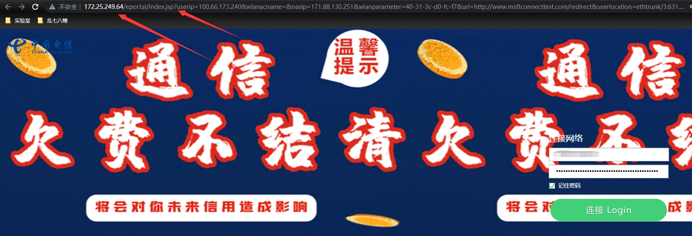
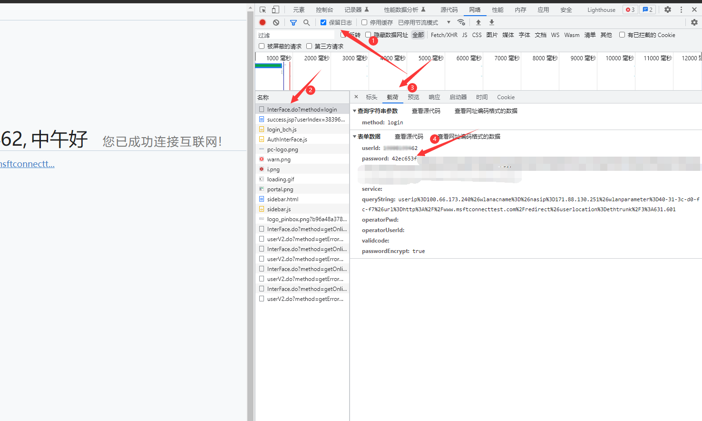
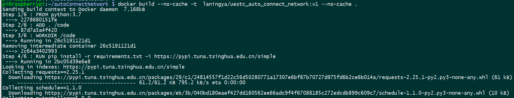
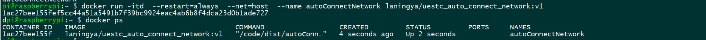

# 校园电信宽带自动连接脚本

## 项目起因

校园电信宽带一大痛点是在路由器断电后，需要手动进行身份认证。在外面遇到寝室断电或者早上赶早八，而没有连接网络，当需要远程宿舍网络时，就会很崩溃。前不久看到有人在朋友圈分享自己写的脚本，今天自己实践一下。

## 脚本地址

**作者提供的地址**：[https://gist.github.com/learnerLj/e327816e735ac8f12a62d18029bb45f0](https://gist.github.com/learnerLj/e327816e735ac8f12a62d18029bb45f0)

在此基础上，我修改了部分代码，更便于后续的部署实践

**修改后的地址**：[https://github.com/laningya/UESTC-WORK/blob/master/%E8%87%AA%E5%8A%A8%E8%BF%9E%E6%8E%A5%E7%94%B5%E4%BF%A1%E7%BD%91%E7%BB%9C/autoConnectNetwork.py](https://github.com/laningya/UESTC-WORK/blob/master/%E8%87%AA%E5%8A%A8%E8%BF%9E%E6%8E%A5%E7%94%B5%E4%BF%A1%E7%BD%91%E7%BB%9C/autoConnectNetwork.py)

先看一下脚本需要提供的信息

- post_url中的IP地址
- post_data中userId，password，queryString

## 实践过程

### 获取脚本需要的信息

1. 获取post_url中的IP地址和post_data中的queryString字段

   

   如图，在电信宽带认证界面的url中，172.25.249.64即为posturl中需要的IP地址；index.jsp? 之后的所有内容为post_data中queryString需要的信息。

2. 获取post_data中的userId和password
   

   如图，需要打开在浏览器打开f12开发者工具，如图为Google  Chrome的调试页面。点击网络，保留日志，双击InterFace.do?method=login选项，选择载荷，找到其中的userId和password字段，并填入代码中，**注意：**pasaword字段后面还有个queryString字段，在步骤1中我们也有一个相同名称的字段，而程序需要的是步骤1中的字段。

3. 至此，我们就获取到脚本需要的所有信息，即可以运行脚本。

### 在树莓派等设备上部署自动执行脚本

1. 树莓派部署自动执行脚本的形式有很多，本次采用crontab服务，在pi用户下，命令行执行以下命令

   ```shell
   cd && mkdir .script && cd .script
   touch autoConnectNetwork.py
   ```

2. 通过vim或者nano编辑器将脚本内容添加到 **autoConnectNetwork.py**中

3. 添加crontab任务，在命令行执行

   ```shell
   crontab -e
   ```

   在文件末尾添加

   ```shell
   #每分钟执行自动连接网络的脚本
   * * * * * /usr/bin/python  /home/pi/.script/autoConnectNetwork.py > /dev/null 2>&1 &
   ```

### 通过Docker部署脚本

1. 下载项目文件和Docker环境以及填写配置文件。Docker的安装方法可以参考[官方文档](https://docs.docker.com/engine/install/)，Docker部署文件地址为：[https://github.com/laningya/UESTC-WORK/tree/master/%E8%87%AA%E5%8A%A8%E8%BF%9E%E6%8E%A5%E7%94%B5%E4%BF%A1%E7%BD%91%E7%BB%9C/Docker](https://github.com/laningya/UESTC-WORK/tree/master/%E8%87%AA%E5%8A%A8%E8%BF%9E%E6%8E%A5%E7%94%B5%E4%BF%A1%E7%BD%91%E7%BB%9C/Docker) 需要的配置与前面一致，配置文件路径为Docker/config/config.txt，填入必要的信息。

2. 构建镜像。如果你是Linux用户，在Docker文件夹下，命令行执行

   ```shell
   docker build --no-cache -t  laningya/uestc_auto_connect_network:v1 .
   ```

   **不要忘记复制后面的点**
   
   ```c++
   说明：
   build:docker构建镜像的命令
   --no-cache:忽略缓存
   -t:指定构建后的镜像名
   ```
   
   
   
3. 运行镜像。还是在/Docker目录下，命令行执行

   ```shell
   docker run -itd  --restart=always  --net=host  --name autoConnectNetwork laningya/uestc_auto_connect_network:v1
   ```

   ```shell
   说明：
   run:docker运行容器的命令
   -itd：可以简单理解为在后台执行
   --restart=always:容器运行出现错误时，自动尝试重启，关键参数，不能轻易取消
   --net=host:指定容器网络为host模式，便于直接访问路由器
   --name utoConnectNetwork 指定容器名，便于后续管理
   laningya/uestc_auto_connect_network:v1 我们前面构建的镜像名称
   ```
   
   
